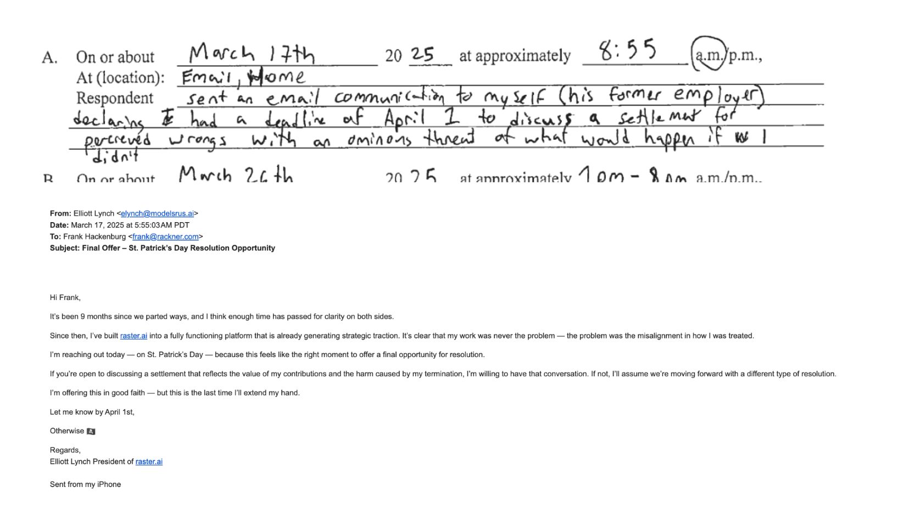
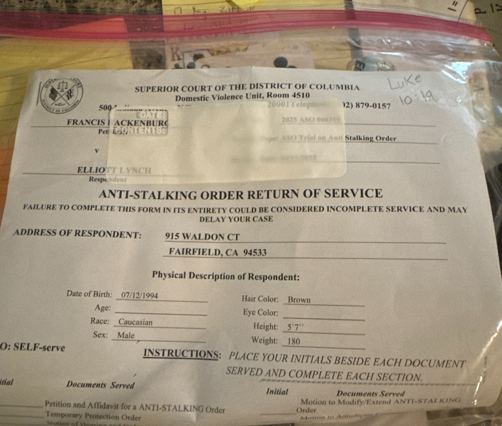
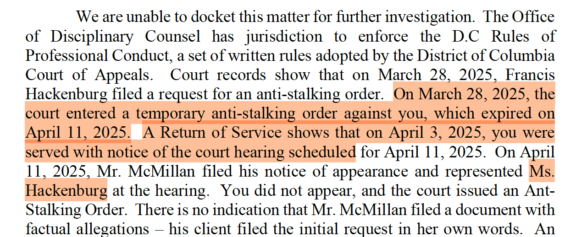
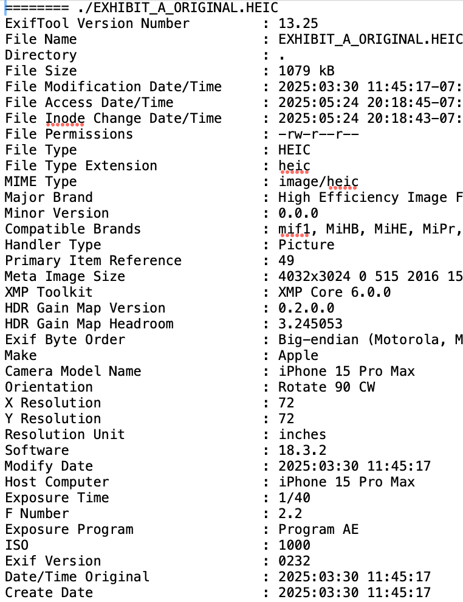
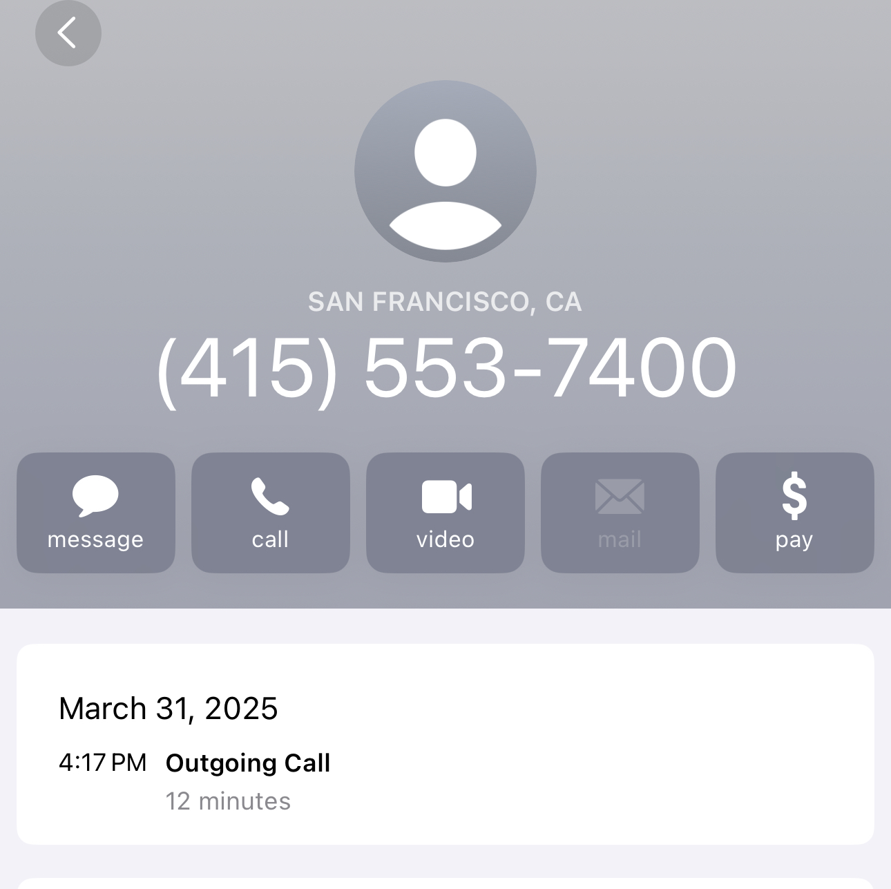

# 🧾 Racknergate: Digital Forensic Evidence Packet
Evidence of Institutional Corruption and Procedural Fraud – DC Superior Court & DC Bar
### "All tyranny needs to gain a foothold is for people of good conscience to remain silent."
— Thomas Jefferson

## 📄 About This Evidence Packet
This repository contains photographic, metadata, and documentary evidence challenging the official record of service issued by the DC Superior Court and the Office of Disciplinary Counsel (ODC) at the DC Bar.

The materials presented directly contradict the claim that Elliott M. Lynch was legally served on or after April 3, 2025, exposing a falsified judicial timeline. These documents are provided in the public interest to support legal accountability, transparency, and whistleblower protection.

## 📌 PERJURY BY PETITIONER FRANK HACKENBURG
Violation of D.C. Code § 22–2402 – Knowingly False Sworn Statement in a Court Proceeding

## Summary:
Petitioner Francis “Frank” Hackenburg knowingly submitted a materially false sworn affidavit to the DC Superior Court in support of an anti-stalking order against whistleblower Elliott M. Lynch. The false statement directly misrepresents the tone, content, and intent of an email sent on March 17, 2025 — a communication that is now preserved, timestamped, and publicly disclosed.

## False Claim in the Affidavit:
"Sent an email communication to myself (his former employer) declaring I had a deadline of April 1 to discuss a settlement for perceived wrongs with an ominous threat of what would happen if we didn’t."

Verifiable Truth (Exhibit Attached: Final Offer – St. Patrick’s Day Resolution Opportunity):
The email in question was a professional, respectful settlement offer, containing no threats, coercion, or hostile language.

The phrase “Otherwise 🏴” was the only metaphorical signal used, intended as a symbolic closing of opportunity (referencing a pirate flag, commonly understood to signal surrender or finality).

Nowhere does the email include any threats of violence or stalking.

The subject line (“Final Offer – St. Patrick’s Day Resolution Opportunity”) and tone throughout reflect good faith legal outreach, not criminal intent.

Why This Constitutes Perjury:
Under D.C. Code § 22–2402, perjury is committed when a person, “in any declaration, verification, certificate, statement, oath, or affidavit required by law, knowingly makes any false material declaration.”

The affidavit was submitted under penalty of perjury in support of a protective order.

The email is material to the outcome — the ASO would not have been granted without it.

The petitioner had access to the original email, meaning the misrepresentation was knowingly false.

Legal Implications:
Frank Hackenburg is now liable for:

Perjury (D.C. Code § 22–2402),

Fraud upon the court (Knowingly misleading a judicial officer to obtain a ruling),

Obstruction of justice (Interfering with the lawful exercise of federal rights),

Retaliation against a whistleblower (by weaponizing judicial systems to discredit or silence protected disclosures),

And potentially conspiracy to commit fraud if coordinated with others.

## Conclusion:
If this Anti-Stalking Order was secured through perjury, and the court continues to act upon it despite irrefutable evidence to the contrary, then the court itself becomes complicit in the fraud.

The affidavit must be rescinded immediately, and a full investigation launched into both the false statements made and the institutional failures that allowed them to be accepted without scrutiny.

Whistleblower communications are not threats.
Truth is not harassment.
And justice cannot coexist with lies.
## THE EMAIL FRANK CLAIMS TO BE EVIDENCE OF STALKING AND HIS WRITTEN SUMMARY OF THE EMAIL IN QUESTION

 </img>

## Digital Forensic evidence related to institutional corruption and procedural fraud at the DC superior court and DC bar

## EXHIBIT A ORIGINAL
Unredacted Original image
Full-resolution image without pixel masking or edits.
* NOTE: THE BELOW IS A SCREENSHOT TO RENDER IN THE BROWSWER -- NOT EXHIBIT_A_ORIGINAL.HEIC -- .HEIC IS NOT HTML COMPATABLE

 </img>

## Lynch Decision Letter – May 21, 2025
Document Title: Lynch Decision Letter 5-21-2025.pdf
This document is an official correspondence from the Office of Disciplinary Counsel, dated May 21, 2025. It is authored by Becky Neal, Senior Assistant Disciplinary Counsel, and outlines the ODC’s position or findings related to the matters under review.
 Please refer to the attached PDF for the full contents of the letter as received.

## 🧾 Their Official Claim
* see Lynch Decision Letter – May 21, 2025 for original
** NOTE: they have also misgendered Frank -- giving the impression their attention to detail and facts is suspect at best.
</img>

## METADATA OF EHIBIT A: EXHIBIT_A_ORIGINAL.HEIC
We encourage independent verification.
All metadata can be validated via tools like exiftool.
<pre>
 <code>
   # darwinOS install
   brew install exiftool
   # then run
   exiftool EXHIBIT_A_ORIGINAL.HEIC
 </code>
</pre>

   </img>

## DATE SNIPPET FROM THE ABOVE METADATA
</img>

## CONCLUSION
IF THE COURT CLAIMS A RETURN SERVICE HAS THE DATE AS 4/3/25 HOW IS ELLIOTT LYNCH IN POSSESSION OF PHOTOGRAPHIC EVIDENCE AND METADATA OF HAVING THE DOCUMENT AS FAR BACK AS MARCH 30TH 2025 AND CLAIMS IT WAS DELIVERED TO HIM AS AN ATTEMPTED WITNESS INTIMIDATION FOR HIS DISCLOSURES AS A FEDERAL WHISTLEBLOWER.

ADDITIONALLY WHY WAS HE ON THE PHONE FOR 12 MINS WITH THE SF FBI TO REPORT THE FORGERY AND WITNESS INTIMIDATION ON 3/31/25 @ 4:17 PM PACIFIC STANDARD TIME BEFORE THE COURT CLAIMS HE WAS EVEN SERVED?

 </img>

AFTER SPENDING AN ENITRE MONTH RETROACTIVELY FALSIFYING COURT RECORDS THE DC SUPERIOR COURT AND DC BAR HAVE BEEN CAUGHT RED HANDED VIOLATING THE CIVIL LIBERTIES OF RASTER.AI PRESIDENT ELLIOTT M. LYNCH

## GUILTY PARTIES LISTED ON THE FRAUDULENT COURT ORDER (COCONSPIRATORS)
* FRANCIS "FRANK" HACKENBERG (PETITIONER) -- aka 'ms. Hackenberg'
* DAVID GAGNER JR
* KEVIN GRIFFITHS
* JAKE ENGEL
* LETITIA MABABU (HEAD OF MZ CONGO FOUNDATION -- WHICH I SUSPECT IS A FRONT FOR INTERNATIONAL MONEY LAUNDERING OR OTHER INTERNATIONAL CRIMES)
* "or any other employees of Rackner, Inc. or the families of any of the individuals named in this"

## OUTCOME
AN IMMEDIATE FEDERAL INVESTIGATION INTO THIS MATTER IS REQUIRED!!!

JANA PATTERSON OF THE US COMMERCE DEPARTMENT -- MOTHER OF RACKNER CEO DAVID GAGNER JR IS WEAPONIZING INSTITUTIONAL CORRUPTION TO SHIELD RACKNER INC. AND AWS ALI OF ICA AND JILL MARION OF THE FDA FROM ELLIOTT LYNCH'S LEGALLY PROTECTED WHISTLEBLOWER DISCLOSURES ABOUT THE HARASSMENT, ILLEGAL FIRING AND ALLEGATIONS OF FRAUD AND RACKETEERING -- CLEAR ABUSE OF POWER AND VIOLATION OF LYNCH'S CIVIL LIBERTIES AS AN AMERICAN CITIZEN AND SMALL BUSSINESS OWNER (RASTER-FARI LLC REGISTERED IN CA AND ITS SUBSIDARY RASTER.AI https://raster.ai).

INVESTIGATE:
* THE DC BAR:
  * PHIL FOX
  * BECKY NEAL
* THE DC SUPERIOR COURT
* JANA PATTERSON
 * QUESTION JANA ABOUT THE FEMALE AFRICAN AMERICAN ATTORNEY SHE WEAPONIZED TO SCRUTIZNE RASTER.AI IN AUGUST 2024 VIA LINKEDIN
* RACKNER
* AWS ALI OF ICA
* SCOTT ORME OF CYLINDER FORMERLY OF ICA UNTIL 3/25
* JILL MARION OF THE FDA
* THE LAW OFFICES OF OFFIT KUMIT
* THE LAW OFFICES OF LITTLER SF
* NIALL MCMILLAN OF OFFIT KUMIT
  * MAIL FRAUD
  * WIRE FRAUD
  * WITNESS INTIMIDATION
  * INTERSTATE CRIMINAL CONSPIRACY

ADDITONALLY INVESTIGATE THE ORIGINAL CLAIMS OF FRAUD AND RACKETEERING ON THE FDA CDRH PROJECT 'MDE' COMMITED BY AWS ALI (ICA) AND RACKNER INC. THAT ELLIOTT LYNCH REPORTED IN JULY 2024 TO MULTIPLE AGENCIES BUT WAS STONEWALLED DIRECTLY ENDANGERING HIS HEALTH, WELLBEING, LIVELIHOOD AND PROFESSIONAL REPUTATION (THROUGH COORDINATED DEFAMATION AND INDUSTRY BLACKLISTING) BY ALLOWING THIS CALAMITY TO ENSUE UNCHECKED.

## ENTITIES OF INTEREST
* FRANKLIN FITCH (FIRM)
* MANUEL OSABA
* OLIVER SHETLER OF NEXTGEN HEALTHCARE
* OWEN LUDDY
* GEORGE WOOD
* ZACH SCHMOELLER

## SUSPECT AT LARGE:
AS NOTED -- ON MARCH 28TH SOMETIME BEWEEN THE HOURS OF 2PM AND 4PM PST I WAS ILLEGALLY SERVED A FRAUDULENT COURT SUMMONS AT MY RESIDENCE IN FAIRFIELD CALIFORNIA.

THE ITEM ARRIVED AND WAS NOT IN AN ENEVELOPE OR MARKED BUT PRESENTED IN A PLASTIC FILM SIMILAR TO A COMIC BOOK SLEEVE.

AS SUCH IT WAS WEAPONIZED AS MY NEIGHBORS CHILDREN WERE ALIGNED IN MY DRIVEWAY ON THEIR BICYLES WATCHING/SERVING AS AN AUDIENCE.

I BELIEVE THE SUSPECT INTERACTED WITH THEM AND POSSIBLY SLANDERED ME IN ORDER TO CREATE FEAR AND A SENSE OF DANGER REGARDING ME AS A NEIGHBOR.

## DESCRIPTION
* WHITE MALE (PRODOMINENT 'ARYAN' FEATURES IN MY PERSONAL OPINION) APPROXIMATELY 28-34 6' 180-190LB.
* GIVEN HIS DESCRIPTION AND FRANK'S GERMAN HERITAGE IT COULD BE POSSIBLE HE IS LINKED TO NEONAZISM OR WHITE NATIONAL AFFILAITION
* I SUSPECT HE WAS AN AGENT FROM THE DARK WEB

## POTENTIALLY CORRELATED FAILED ROBBERY (PERCEIVED)
FURTHERMORE -- ON 11/3/23 AT APROXIMATELY 1:43AM I WAS AT THE ARCO GAS STATION AFTER PICKING UP MY CAR -- IN THE PROCESS OF MOVING HOUSES AND RETURNING A UHAUL. AFTER FILLING UP, I WENT TO PUT AIR IN MY TIRES AT THE SERVICE AREA AND WAS BLOCKED IN PERPENDICULARLY BY A RED DODGE RAM 1500 OR SIMILAR RAM. I IMMEDIATLY WENT INTO EVASIVE MANUEVERS AND STARTED THE VEHICLE -- CRACKED THE WINDOW AND COMMANDED I WOULD PROCEED TO RAM THEM IF THEY DIDN'T MOVE. FORTUNATELY HE PANICKED AND REVERSED AND I WAS ABLE TO GET AWAY AFTER CALLING OUT 'PSYCHO' AS I LEFT THE GAS STATION.
I DID NOT REPORT THIS INCIDENT AS NOTHING MATERIAL TRANSPIRED HOWEVER WHILE I YELLED OUT I GOT A GLIMPSE OF THE MANS FACE AND COULD SEE HE WAS WHITE.
IT IS MY PERSONAL OPINION THAT THIS WAS THE SAME MAN THAT DELIVERED THE FORGED COURT ORDER AS WHEN I INSPECTED HIS FACE I HAD THE UNCANNY SENSE THIS WAS NOT THE FIRST TIME I HAD SEEN HIM.

WHILE THIS MIGHT BE PURELY ANNECDOTAL IT IS WORTH CONSIDERING AS THIS ONLY OCCURED 2 MONTHS BEFORE MY WORKPLACE HARASSMENT BEGAN (1/24).

### NOTE
This package is submitted in good faith as part of a formal response and/or evidentiary disclosure. All referenced attachments are included for independent verification.

This folder contains documents released under Creative Commons CC0 1.0.
https://creativecommons.org/publicdomain/zero/1.0/

These materials are shared in the public interest for purposes of accountability and transparency.

### 📎 NOTE TO THE FBI
If you have, in fact, been investigating this matter all along — I am willing and prepared to issue a public retraction of the prior statements made by raster.ai condemning your inaction.

I acknowledge that I do not know the full scope of your agency’s operations, and it’s becoming clear that this situation may be far larger and more complex than I initially understood.

#### Let it be known:
<i>I am not here to dictate your actions — I am simply a dedicated patriot, committed to the ideals laid down by the founding fathers of this country. And I will continue to fight to defend them, as this evidence packet — Racknergate — clearly demonstrates.</i>

# 🇺🇸 GOD BLESS AMERICA — LET FREEDOM RING  
**🦅 Whistleblowers aren't the problem. They're the firewall.**
