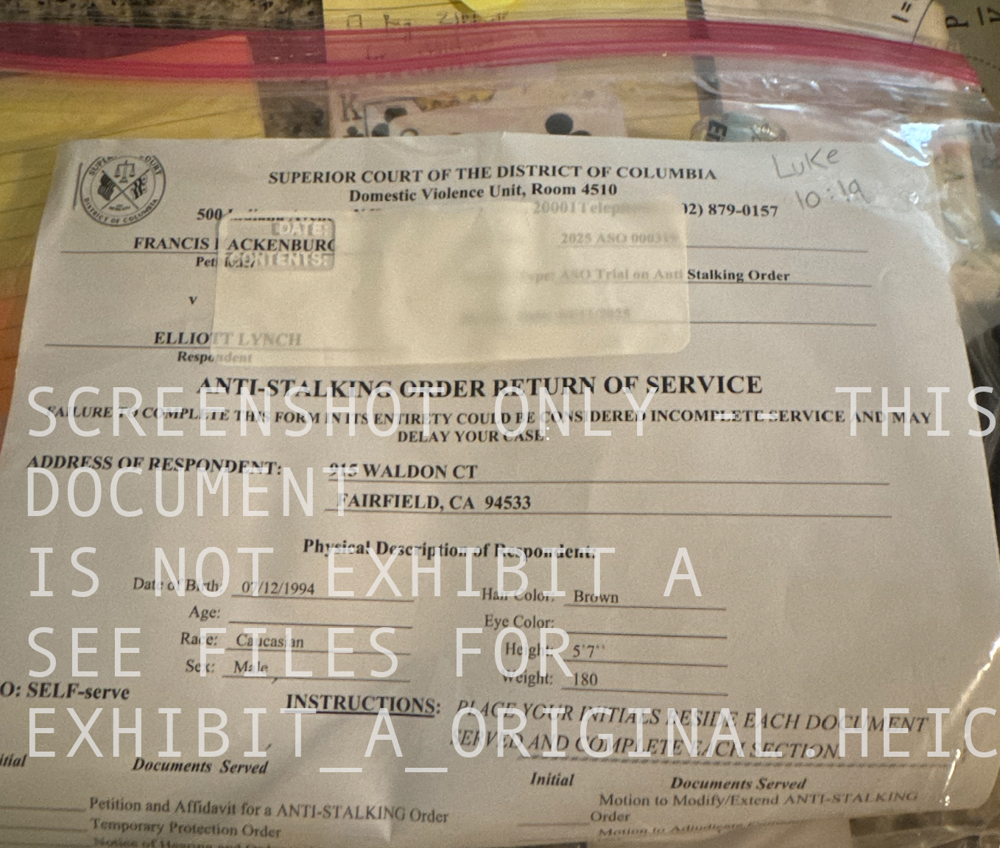
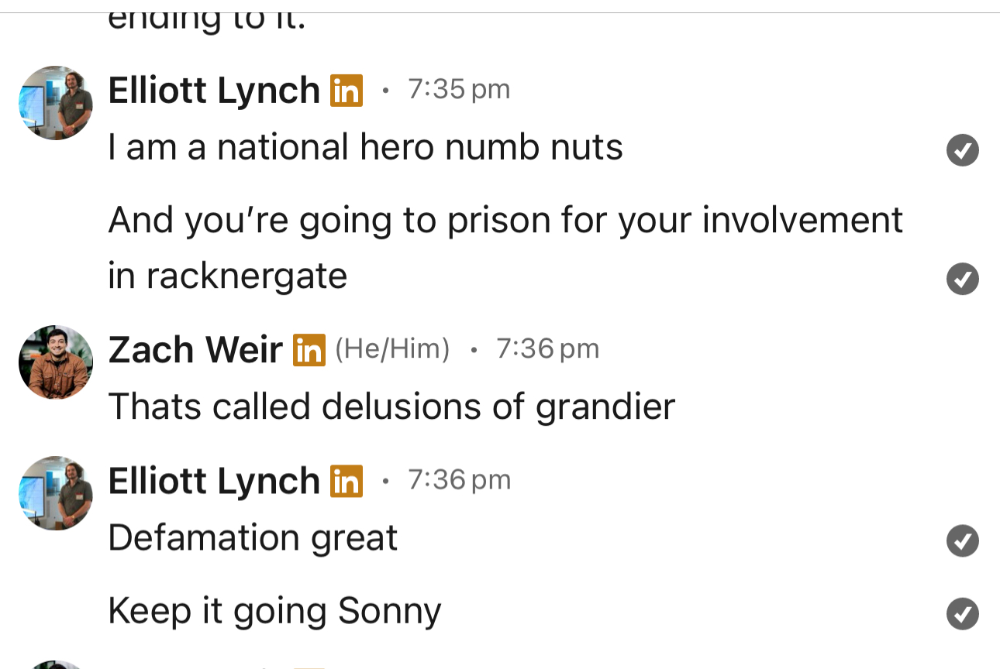

# EIA (ELLIOTT INTELLIGENCE AGENCY) CASE: 00A
# 🧾 Racknergate: Digital Forensic Evidence Packet

Evidence of Institutional Corruption and Procedural Fraud – DC Superior Court & DC Bar

INVESTIGATION REPORT COMPILED BY EIA DIRECTOR ELLIOTT LYNCH CODENAME: "THE EAGLE 🦅"

### "All tyranny needs to gain a foothold is for people of good conscience to remain silent."
— Thomas Jefferson

## 📄 About This Evidence Packet
This repository contains photographic, metadata, and documentary evidence challenging the official record of service issued by the DC Superior Court and the Office of Disciplinary Counsel (ODC) at the DC Bar.

The materials presented directly contradict the claim that Elliott M. Lynch was legally served on or after April 3, 2025, exposing a falsified judicial timeline. These documents are provided in the public interest to support legal accountability, transparency, and whistleblower protection.

 </img>

<i>WHO YOU TRY'NA FRAME? --GHOSTCASE BUSTERS!</i>

## 📌 PERJURY BY PETITIONER FRANK HACKENBURG
Violation of D.C. Code § 22–2402 – Knowingly False Sworn Statement in a Court Proceeding

## Summary:
Petitioner Francis “Frank” Hackenburg knowingly submitted a materially false sworn affidavit to the DC Superior Court in support of an anti-stalking order against whistleblower Elliott M. Lynch. The false statement directly misrepresents the tone, content, and intent of an email sent on March 17, 2025 — a communication that is now preserved, timestamped, and publicly disclosed.

## False Claim in the Affidavit:
"Sent an email communication to myself (his former employer) declaring I had a deadline of April 1 to discuss a settlement for perceived wrongs with an ominous threat of what would happen if we didn’t."

Verifiable Truth (Exhibit Attached: Final Offer – St. Patrick’s Day Resolution Opportunity):
The email in question was a professional, respectful settlement offer, containing no threats, coercion, or hostile language.

The phrase “Otherwise 🏴‍☠️” was the only metaphorical signal used, intended as a symbolic closing of opportunity (referencing a pirate flag, commonly understood to signal surrender or finality).

Furthermore, historically the black flag is a symbol that surrender is possible while a red flag does not offer quartering. Hence why it is likely Apple does not make a red jolly roger emoji but we are free to use the black one on every single iphone in existance.

Specifically, my use of the jollyrogers was a reference to my Silicon Valley ethos and one of my favorite films (or tv movie apparently) "Pirates of Sillicon Valley" (1999).
Nowhere does the email include any threats of violence or stalking.

The subject line (“Final Offer – St. Patrick’s Day Resolution Opportunity”) and tone throughout reflect good faith legal outreach, not criminal intent.

Why This Constitutes Perjury:
Under D.C. Code § 22–2402, perjury is committed when a person, “in any declaration, verification, certificate, statement, oath, or affidavit required by law, knowingly makes any false material declaration.”

The affidavit was submitted under penalty of perjury in support of a protective order.

The email is material to the outcome — the ASO would not have been granted without it.

The petitioner had access to the original email, meaning the misrepresentation was knowingly false.

Legal Implications:
Frank Hackenburg is now liable for:

Perjury (D.C. Code § 22–2402),

Fraud upon the court (Knowingly misleading a judicial officer to obtain a ruling),

Obstruction of justice (Interfering with the lawful exercise of federal rights),

Retaliation against a whistleblower (by weaponizing judicial systems to discredit or silence protected disclosures),

And potentially conspiracy to commit fraud if coordinated with others.

## Conclusion:
If this Anti-Stalking Order was secured through perjury, and the court continues to act upon it despite irrefutable evidence to the contrary, then the court itself becomes complicit in the fraud.

The affidavit must be rescinded immediately, and a full investigation launched into both the false statements made and the institutional failures that allowed them to be accepted without scrutiny.

Whistleblower communications are not threats.
Truth is not harassment.
And justice cannot coexist with lies.
## THE EMAIL FRANK CLAIMS TO BE EVIDENCE OF STALKING AND HIS WRITTEN SUMMARY OF THE EMAIL IN QUESTION

 </img>

## Digital Forensic evidence related to institutional corruption and procedural fraud at the DC superior court and DC bar

## EXHIBIT A ORIGINAL
Unredacted Original image
Full-resolution image without pixel masking or edits.
* NOTE: THE BELOW IS A SCREENSHOT TO RENDER IN THE BROWSWER -- NOT EXHIBIT_A_ORIGINAL.HEIC -- .HEIC IS NOT HTML COMPATABLE

 </img>

## Lynch Decision Letter – May 21, 2025
Document Title: Lynch Decision Letter 5-21-2025.pdf
This document is an official correspondence from the Office of Disciplinary Counsel, dated May 21, 2025. It is authored by Becky Neal, Senior Assistant Disciplinary Counsel, and outlines the ODC’s position or findings related to the matters under review.
 Please refer to the attached PDF for the full contents of the letter as received.

## 🧾 Their Official Claim
* see Lynch Decision Letter – May 21, 2025 for original
** NOTE: they have also misgendered Frank -- giving the impression their attention to detail and facts is suspect at best.
</img>

## METADATA OF EHIBIT A: EXHIBIT_A_ORIGINAL.HEIC
We encourage independent verification.
All metadata can be validated via tools like exiftool.
<pre>
 <code>
   # darwinOS install
   brew install exiftool
   # then run
   exiftool EXHIBIT_A_ORIGINAL.HEIC
 </code>
</pre>

   </img>

## DATE SNIPPET FROM THE ABOVE METADATA
</img>

## CONCLUSION
IF THE COURT CLAIMS A RETURN SERVICE HAS THE DATE AS 4/3/25 HOW IS ELLIOTT LYNCH IN POSSESSION OF PHOTOGRAPHIC EVIDENCE AND METADATA OF HAVING THE DOCUMENT AS FAR BACK AS MARCH 30TH 2025 AND CLAIMS IT WAS DELIVERED TO HIM AS AN ATTEMPTED WITNESS INTIMIDATION FOR HIS DISCLOSURES AS A FEDERAL WHISTLEBLOWER.

ADDITIONALLY WHY WAS HE ON THE PHONE FOR 12 MINS WITH THE SF FBI TO REPORT THE FORGERY AND WITNESS INTIMIDATION ON 3/31/25 @ 4:17 PM PACIFIC STANDARD TIME BEFORE THE COURT CLAIMS HE WAS EVEN SERVED?

 </img>

AFTER SPENDING AN ENITRE MONTH RETROACTIVELY FALSIFYING COURT RECORDS THE DC SUPERIOR COURT AND DC BAR HAVE BEEN CAUGHT RED HANDED VIOLATING THE CIVIL LIBERTIES OF RASTER.AI PRESIDENT ELLIOTT M. LYNCH

## GUILTY PARTIES LISTED ON THE FRAUDULENT COURT ORDER (COCONSPIRATORS)
* FRANCIS "FRANK" HACKENBURG (PETITIONER) -- aka 'ms. Hackenburg'
* DAVID GAGNER JR
* KEVIN GRIFFITHS
* JAKE ENGEL
* LETITIA MABABU (HEAD OF MZ CONGO FOUNDATION -- WHICH I SUSPECT IS A FRONT FOR INTERNATIONAL MONEY LAUNDERING OR OTHER INTERNATIONAL CRIMES)
* "or any other employees of Rackner, Inc. or the families of any of the individuals named in this"

## 💼 Constructive Blacklisting and Coordinated Industry Suppression
### Summary:
Based on the timing, behavior patterns, and systemic anomalies observed across multiple interview pipelines, it is reasonable to conclude that a coordinated reputational attack and constructive blacklisting campaign was initiated against Elliott M. Lynch. This campaign appears to have originated from a senior official within the U.S. Department of Commerce and was disseminated under the pretext of “concern for the broader business community.”

This method of suppression is not formally documented but is evidenced by the recurring pattern of evasive treatment, deliberate time-wasting interview processes, unwarranted rejections, and excessive gatekeeping experienced by Mr. Lynch across unrelated employers and firms with federal affiliations.

### Pattern of Constructive Retaliation:
Extended interview processes with no technical engagement and no transparent reason for rejection.

Ghosting or inconsistent follow-up despite strong performance and high alignment with roles.

Firms acting with unexplained caution after initially expressing strong interest—indicative of backchannel influence or warnings.

Third-party recruitment firms presenting as intermediaries without being hired by Mr. Lynch, followed by narrative inconsistencies and attempts to reframe their involvement as initiated by him.

Increased proximity to federal contractors, Commerce-connected firms, and government-adjacent executives in the affected opportunities.

### Legal Implications:
If this suppression was instigated by a federal official or government-connected individual:

It may constitute tortious interference with prospective economic advantage,

Retaliation under federal whistleblower statutes,

And possibly defamation per se, given the likely use of false statements regarding Mr. Lynch’s criminality or professionalism.

Statements made by a senior Commerce official to private sector employers, such as “he is a bad actor,” or “he poses a risk,” if not supported by evidence and designed to deter employment, meet the legal standard for malicious and defamatory intent.

This campaign is further aggravated by its likely chilling effect—sending an informal signal to hiring pipelines not to engage, wasting Mr. Lynch’s time and professional bandwidth, and ultimately denying him equal access to economic opportunity and reputational due process.

### Conclusion:
This pattern reflects a systemic abuse of influence designed to punish Mr. Lynch for protected whistleblower disclosures under the guise of “protecting the business community.” It constitutes a constructive and retaliatory blacklist, executed without transparency, outside of any judicial process, and in violation of both ethical standards and potentially federal law.

This constitutes not only reputational injury, but economic sabotage and civil rights interference, and must be investigated accordingly.

## OUTCOME
AN IMMEDIATE FEDERAL INVESTIGATION INTO THIS MATTER IS REQUIRED!!!

JANA PATTERSON OF THE US COMMERCE DEPARTMENT -- MOTHER OF RACKNER CEO DAVID GAGNER JR IS WEAPONIZING INSTITUTIONAL CORRUPTION TO SHIELD RACKNER INC. AND AWS ALI OF ICA AND JILL MARION OF THE FDA FROM ELLIOTT LYNCH'S LEGALLY PROTECTED WHISTLEBLOWER DISCLOSURES ABOUT THE HARASSMENT, ILLEGAL FIRING AND ALLEGATIONS OF FRAUD AND RACKETEERING -- CLEAR ABUSE OF POWER AND VIOLATION OF LYNCH'S CIVIL LIBERTIES AS AN AMERICAN CITIZEN AND SMALL BUSSINESS OWNER (RASTER-FARI LLC REGISTERED IN CA AND ITS SUBSIDARY RASTER.AI https://raster.ai).

INVESTIGATE:
* THE DC BAR:
  * PHIL FOX
  * BECKY NEAL
* THE DC SUPERIOR COURT
* JANA PATTERSON
 * QUESTION JANA ABOUT THE FEMALE AFRICAN AMERICAN ATTORNEY AT THE COMMERCE SHE WEAPONIZED TO SCRUTIZNE < 1 MONTH OLD RASTER.AI IN AUGUST 2024 VIA LINKEDIN.
* RACKNER
* AWS ALI OF ICA
* SCOTT ORME OF CYLINDER FORMERLY OF ICA UNTIL 3/25
* JILL MARION OF THE FDA
* THE LAW OFFICES OF OFFIT KUMIT
* THE LAW OFFICES OF LITTLER SF
  * SINCE THEY ARE A MAJOR EMPLOYMENT LAWFIRM IN THE SF BAY AREA I SUSPECT JANA WANTED TO PREEMPTIVELY UTILIZE THEM TO HEDGE THE POSSIBILTY OF ME SEEKING A CASE THERE.
* NIALL MCMILLAN OF OFFIT KUMIT
  * MAIL FRAUD
  * WIRE FRAUD
  * WITNESS INTIMIDATION
  * INTERSTATE CRIMINAL CONSPIRACY
* GEORGE WOOD
* FRANKLIN FITCH
* MANUEL OSABA (THE MAN WHO REACHED OUT ABOUT A JOB AT LITTLER WHO GEORGE WOOD OF LITTLER THEN CLAIMED WAS PART OF A SEARCH FIRM HIRED BY ME. I HAVE AT NO POINT EVER HIRED A SEARCH FIRM AND THE FIRM IN QUESTION WAS FRANKLIN FITCH.

 </img>

I DID NOT LOOK FOR A JOB AT LITTLER MANUEL OSABA OF FRANKLIN FITCH REACHED OUT TO ME ABOUT IT.

WHEN I ASKED OSABA WHY LITTLER WAS UNDER THE IMPRESSION I HAD HIRED THE SEARCH FIRM, MANUEL WHO WAS NOW AT PIPER MADDOX STONEWALLED BUT LEFT THE COMMUNICATIONS OPEN BECAUSE I BELIEVE HE WAS FEEDING THEM TO HIS HANDLER OR CONTACT.

IF LITTLER HADN'T HIRED FRANKLIN FITCH -- AND LITTLER WAS UNDER THE IMPRESSION I HAD -- THEN SOMEONE ELSE HAD HIRED THEM ON MY BEHALF (JANA PATTERSON) OR THAT MANUEL OSABA HAD FALSELY ASSERTED THAT HE WAS ACTING AS AN AGENT ON MY BEHALF.

JOB APPLICATIONS ARE EXTREMELY BASIC PROCESSES THAT ABSOLUTELY REQUIRE ZERO MEDIATION OR INVOLVEMENT OF A THIRD PARTY COMMUNICATING ON MY BEHALF WITHOUT MY KNOWLEDGE.

WHEN TAGGED IN A RECENT "RACKNERGATE" POST I MADE ON LINKEDIN MANUEL FINALLY BLOCKED ME.

FURTHERMORE GEORGE WOOD STATES "ALL THE COMMUNICATION" -- IF THIS WAS SIMPLY ABOUT LEADING ME TO APPLY FOR A JOB AND LITTLER TAKING IT FROM THERE THEN WHAT COMMUNICATION COULD POSSIBLY EVEN BE INVOLED AND WHY WAS GEORGE WOOD GENERAL COUNSEL PRIVVY TO IT AND SPEAKING AS IF IT WAS FIRST HAND KNOWLEDGE AND FACT?

### STONEWALLING WHEN PROMPTED TO CLARIFY

 </img>

* ANDESITE -- TIME WASTING MULTI ROUND INTERVIEW -- SELECTED A SIGNIFICANTLY LESS EXPERIENCE AND SKILLED CANDIDATE AFTER I GAVE A FLAWLESS INTERVIEW THROUGH ALL ROUNDS. -- GOVERNMENT TIES THROUGH ITS CEO AND EX CIA DIRECTOR BRIAN CARBAUGH. FURTHERMORE THE ENTIRE BOARD OF ANDESITE IS EITHER FORMER GOV OR GOVERMENT AJACENT SO ITS ENTIRELY PLAUSIBLE THEY WERE WELL WITHIN JANAS SPHERE OF INFLUENCE. 
* OPENSESAME -- TIME WASTING MULTI ROUND INTERVIEW -- I GAVE A FLAWLESS INTERVIEW THROUGH ALL ROUNDS. AT NO TIME DID I SPEAK TO ANYONE TECHNICALLY QUALIFIED AND MAYA HOFFMAN CALLED ME EXCESSIVELY AND EVEN MULTIPLE TIMES AFTER AN INTERVIEW WHEN I TOLD HER I WAS UNWELL WITH A MIGRAINE. FELT LIKE HARASSMENT AND THEN SHE ULTIMATELY TURNED ME DOWN FOR THE ROLE BECAUSE I LACKED PRODUCT MANAGEMENT EXPERIENCE DESPITE IT BEING A VERY SIMPLE VECTOR DATABASE PROJECT I WAS TO COMPLETE SOLO. AI ENGINEER IS NOT A PRODUCT MANAGEMENT ROLE THEY ARE UNIQUE. BY THEIR OWN ADMISSION THE OTHER CANDIDATE WAS NOT ABLE TO ARTICULATE HIS SOLUTIONS AS WELL AS I WAS SO I SUSPECT MAYA WAS BRIBED OR THERE WAS SOME SORT OF A REWARD SYSTEM FOR WASTING MY TIME AT LARGE IN THE INDUSTRY AS CONDUCTED BY JANA PATTERSON.
  
ADDITONALLY INVESTIGATE THE ORIGINAL CLAIMS OF FRAUD AND RACKETEERING ON THE FDA CDRH PROJECT 'MDE' COMMITED BY AWS ALI (ICA) AND RACKNER INC. THAT ELLIOTT LYNCH REPORTED IN JULY 2024 TO MULTIPLE AGENCIES BUT WAS STONEWALLED DIRECTLY ENDANGERING HIS HEALTH, WELLBEING, LIVELIHOOD AND PROFESSIONAL REPUTATION (THROUGH COORDINATED DEFAMATION AND INDUSTRY BLACKLISTING) BY ALLOWING THIS CALAMITY TO ENSUE UNCHECKED.

## ENTITIES OF INTEREST
* OLIVER SHETLER OF NEXTGEN HEALTHCARE -- DECEPTIVE INTERVIEW AND GHOST WITH NO JUSTIFICATION DESPITE THE INTERVIEW GOING WELL AND BEING EXTREMELY BASIC
  * FACIAL TWITCHING DURING INTERVIEW DEMONSTRATING AGITATION AS IF THERE WAS PREMEDITATED ANIMOSITY TOWARD ME DESPITE BEING A PERFECT STRANGER.
* OWEN LUDDY -- DECEPTIVE INTERVIEW AND GHOST WITH NO JUSTIFICATION DESPITE THE INTERVIEW GOING WELL
* VISHNU OF HOPLABS (ATLANTA) --UTILIZED DECEPTION IN SAYING MY RESUME STOOD OUT AND HE WANTED TO INTERVIEW AND THEN EXHIBITED THE PATTERN OF BEHAVIOR I EXPERIENCED WHERE THEY CONDUCT A MERITLESS INTERVIEW VERY INFORMALLY AS BRIEFLY AS POSSIBLE AND THEN GHOST FOR NO REASON.
* JEFF G. OF EXCELLA -- FINAL ROUND REJECTION FOR BASELESS AND BORDERLINE DEFAMATORY PROJECTION THAT I WAS UNSUITABLE TO WORK ON A TEAM. PERHAPS A PERSONAL CHOICE AND NOT NECESSARILY RELATED TO THE CONSPIRACY HOWEVER THE INDUSTRY AND LOCAL PROXIMITY TO DC ARE WORTH NOTING AS WELL AS THE FACT THEY ARE IN THE FEDERAL CONTRACTING SPACE.
* ZACH SCHMOELLER -- HIGHLY EVASIVE WHEN ASKED TO GIVE A WRITTEN STATEMENT OF NONE INVOLVEMENT AND REPEATEDLY ALLEGED I WAS THREATENING HIM WHEN THIS IS A SERIOUS LEGAL & BUSINESS MATTER AND I HAVE A RIGHT TO CONDUCT DUE DILLEGENCE.

TIME WASTING INTERVIEW THAT ZACH REACHED OUT TO ME FOR VIA LINKEDIN (ONCE AGAIN). HOWEVER IT'S ALSO PLAUSIBLE IT WAS JUST TYPICAL INDUSTRY RUNAROUND. HOWEVER WHEN THE ALLEGATIONS OF BEING CONNECTED TO SOMETHING ARE THIS SERIOUS ANY SANE AND RATIONAL INNOCENT PERSON WITH NOTHING TO HIDE WOULD NOT HESSITATE. WHATS THE HARM OF COMMITING TRUTH TO A WRITTEN STATEMENT TO HELP OUT A MATTER OF NATIONAL SECURITY?

## SUSPECT AT LARGE:

## DESCRIPTION
* WHITE MALE (PRODOMINENT 'ARYAN' FEATURES IN MY PERSONAL OPINION) APPROXIMATELY 28-34 | 6' | 180-190LB.
* GIVEN HIS DESCRIPTION AND FRANK'S GERMAN HERITAGE IT COULD BE POSSIBLE HE IS LINKED TO NEONAZISM OR WHITE NATIONAL AFFILIATION
* I SUSPECT HE WAS AN AGENT FROM THE DARK WEB
  
AS NOTED -- ON MARCH 28TH SOMETIME BEWEEN THE HOURS OF 2PM AND 4PM PST I WAS ILLEGALLY SERVED A FRAUDULENT COURT SUMMONS AT MY RESIDENCE IN FAIRFIELD CALIFORNIA.

THE ITEM ARRIVED AND WAS NOT IN AN ENEVELOPE OR MARKED BUT PRESENTED IN A PLASTIC FILM SIMILAR TO A COMIC BOOK SLEEVE.
I HAVE RETAINED BOTH THE DOCUMENT AND SLEAVE AS EVIDENCE -- AND REPORTED THIS TO THE FBI ON 3/31/25 AS MENTIONED ABOVE.

## POSSIBLE CYBERATTACK VECTOR
GIVEN THIS DOCUMENT WAS FORGED AND INCLUDED A URL TO A SUPPOSED HEARING ON 4/11/25 I SUSPECT THE LINK WAS A POTENTIAL CYBER  ATTACK TO STEAL THE INTELECTUAL PROPERTY OF RASTER.AI -- NAMELY LAUNCHPAD: THE ML PLATFORM BY RASTER.AI -- A REVOLUTIONARY PARADIGM IN MACHINE LEARNING THAT RUNS IN THE BROWSER FOR SECURE LOCAL TRAINING AND STREAMS/MANAGES MACHINE LEARNING TRAINING ON THE CLOUD FOR THE CLOUD EDITION (ENTERPRISE).

IT'S ALSO POSSIBLE THEY WERE NOT THAT SOPHISTICATED AND SIMPLY WANTED TO INFILTRATE MY NETWORK TO MONITOR ME.

THE REASON I MENTION THIS -- IS THE URL BASED NATURE OF THE "VIDEO COURT SYSTEM". IT IS ENTIRELY PLAUSIBLE THAT WAS GOING TO WEAPONIZED AS A CYBER ATTACK VECTOR POSSIBLY INVOLVING 3RD PARTY HACKERS.

## NO-SHOW TO KANGAROO COURT
HENCE I DID NOT SHOW UP -- AND WAS 'SERVED' A COURTESY COPY OF A FORGED DEFAULT ORDER BY NIALL WHILE HE SIMULTANEOUSLY. 

I REPORTED HIM TO THE BAR WITHIN HALF AN HOUR AND INFORMED HIM HE WAS BEING USED AS A PAWN IN A MUCH LARGER PLOT AS WELL AS DISCLOSED MY INTENTION TO HAVE HIM DISBARRED.

THE 'COURTESY COPY' ASPECT WAS INSTANTLY SUSPECT TO ME.

AS SUCH IT WAS WEAPONIZED AS MY NEIGHBORS CHILDREN WERE ALIGNED IN MY DRIVEWAY ON THEIR BICYLES WATCHING/SERVING AS AN AUDIENCE.

I BELIEVE THE SUSPECT INTERACTED WITH THEM AND POSSIBLY SLANDERED ME IN ORDER TO CREATE FEAR AND A SENSE OF DANGER REGARDING ME AS A NEIGHBOR.

FAIRFIELD POLICE FOLLOWED UP ABOUT THE INCIDENT BUT ALSO DECLINED TO COLLECT THE EVIDENCE.

THE INCIDENT NUMBER WAS STATED AS <b>231</b>.

I HAD THE PERSONAL IMPRESSION THEY WERE MORE INTERESTED IN TREATING ME LIKE A PERSON OF INTEREST AND WHEN I MENTIONED THIS POTENTIALLY INVOLVED A CYBERCRIME PLOT THE OFFICER ACTED AS IF I WAS DELUSIONAL OR WAS MAKING FALSE CLAIMS OF HAVING INTELECTUAL PROPERTY WORTH STEALING VIA A CYBER ATTACK.
WHILE BEING UNDER DURESS FROM THE GRAVITY OF THE SITUATION AND BEING HUNG UP ON BY THE FBI AFTER I MADE A MOVE TO DO THE RESPONSIBLE THING I FELT VERY MUCH THAT I WAS NO A SITTING DUCK AND ACTUALLY WENT OUT TO BUY MOVING BOXES BECAUSE I WAS CONCERNED I WOULD HAVE TO MOVE FOR MY SAFETY SINCE THEY KNEW I WAS STILL AT THIS HOUSE AND HAD SENT SOMEONE ON THEIR BEHALF TO MY DOORSTEP TO SERVE ME AN OBVIOUSLY FORGED AND IMPROPERLY SERVED COURT ORDER THAT INTENDED TO REVOKE MY 2A AT A TIME WHERE SELF DEFENSE WAS OF PARAMOUNT IMPORTANCE.

ONCE I KNEW THEY WERE ATTEMPTING TO DISARM ME IT BECAME VERY CELAR TO ME THAT THERE WAS A CREDIBLE THREAT FOR MY LIFE.

FOR THE NEXT 10-12 DAYS I FELT UNCOMFORTABLE SLEEPING AT NIGHT AND WOULD WAIT IT OUT AND SLEEP IN THE MORNING AROUND 6AM AS I FELT UNSAFE AND A COMPLETE SITTING DUCK.

FURTHERMORE I BECAME CONCERNED ABOUT MY FAMILIES WELL BEING AND IT HAS BEEN EXTREMELY STRESSFUL FOR US ALL AND STILL IS WHEN SEEMINLY INSTITUTIONS OF AUTHORITY ARE AVOIDING TAKING ACTION.

## POTENTIALLY CORRELATED FAILED ROBBERY (PERCEIVED)
FURTHERMORE -- ON 11/3/23 AT APROXIMATELY 1:43AM I WAS AT THE ARCO GAS STATION AFTER PICKING UP MY CAR -- IN THE PROCESS OF MOVING HOUSES AND RETURNING A UHAUL. AFTER FILLING UP, I WENT TO PUT AIR IN MY TIRES AT THE SERVICE AREA AND WAS BLOCKED IN PERPENDICULARLY BY A RED DODGE RAM 1500 OR SIMILAR RAM. I IMMEDIATLY WENT INTO EVASIVE MANUEVERS AND STARTED THE VEHICLE -- CRACKED THE WINDOW AND COMMANDED I WOULD PROCEED TO RAM THEM IF THEY DIDN'T MOVE. FORTUNATELY HE PANICKED AND REVERSED AND I WAS ABLE TO GET AWAY AFTER CALLING OUT 'PSYCHO' AS I LEFT THE GAS STATION.
I DID NOT REPORT THIS INCIDENT AS NOTHING MATERIAL TRANSPIRED HOWEVER WHILE I YELLED OUT I GOT A GLIMPSE OF THE MANS FACE AND COULD SEE HE WAS WHITE AND HAD GAUNT FACIAL FEATURES.
IT IS MY PERSONAL OPINION THAT THIS WAS THE SAME MAN THAT DELIVERED THE FORGED COURT ORDER AS WHEN I INSPECTED HIS FACE I HAD THE UNCANNY SENSE THIS WAS NOT THE FIRST TIME I HAD SEEN HIM.

WHILE THIS MIGHT BE PURELY ANECDOTAL IT IS WORTH CONSIDERING AS THIS ONLY OCCURED 2 MONTHS BEFORE MY WORKPLACE HARASSMENT BEGAN (1/24).

# 🔒 Final Statement: Legal Sufficiency & Investigative Priority
This packet does not merely allege wrongdoing—it proves it.
It contains verifiable evidence, named individuals, legal citations, and a complete timeline of coordinated retaliation spanning federal offices, private sector actors, and judicial mechanisms.

The core violations include, but are not limited to:

Perjury (D.C. Code § 22–2402),

Fraud upon the court,

Abuse of process,

Whistleblower retaliation (per federal protection statutes),

Tortious interference with economic relations,

And potentially interstate criminal conspiracy and RICO predicate acts.

These are not abstract grievances.
They are documented harms—inflicted with intent, executed through procedural corruption, and shielded by institutional silence.

There is now probable cause for federal investigation and judicial review. Every necessary lead, contact, and evidentiary item is contained within this packet.

So the question is no longer, “What happened?”
That question has been answered.

Now the only question that remains is:

Will any institution act on the overwhelming evidence already in front of them? Or is this country truly operating as if I don't deserve life, liberty, and the pursuit of happiness?

If the answer is silence, then the message is clear:
The American dream is conditional.
Justice is negotiable.
And whistleblowers stand alone.

But if even one person of conscience reads this and takes action—
Then it was never in vain.

### INDIVIDUAL SUSPECTS
I AM OPERATING UNDER THE ASSUMPTION THAT IT IS NOW TIME TO MOVE ON TO INDIVIDUAL SUSPECTS GIVEN THE ASSUMED NEUTRALIZATION OF VARIOUS HIGH LEVEL BAD ACTORS SUCH AS RACKNER, AWS, JANA.

## ZACH WEIR -- INERVIEW CALL ON 2/13/25

## EIA FOLLOW UP INVESTIGATION (5/30/25)
### EIA PROMPT TO ZACH:

 </img>

#### 📁 Zach Weir — Admission of Willingness to Forge Documents

 </img>

#### DEFAMATION
EXHIBIT A

 </img>

EXHIBIT B

 </img>

🟢 Primary Finding:
Individual openly solicited forgery in exchange for financial compensation, stating:

"What do you need me to produce or forge?"

### NOTE
This package is submitted in good faith as part of a formal response and/or evidentiary disclosure. All referenced attachments are included for independent verification.

This folder contains documents released under Creative Commons CC0 1.0.
https://creativecommons.org/publicdomain/zero/1.0/

These materials are shared in the public interest for purposes of accountability and transparency.

### 📎 NOTE TO THE FBI
If you have, in fact, been investigating this matter all along — I am willing and prepared to issue a public retraction of the prior statements made by raster.ai condemning your inaction.

I acknowledge that I do not know the full scope of your agency’s operations, and it’s becoming clear that this situation may be far larger and more complex than I initially understood.
### 📎 NOTE TO THE CIA
THANKS

#### Let it be known:
<i>I am not here to dictate your actions — I am simply a dedicated patriot, committed to the ideals laid down by the founding fathers of this country. And I will continue to fight to defend them, as this evidence packet — Racknergate — clearly demonstrates.</i>

# 🇺🇸 GOD BLESS AMERICA — LET FREEDOM RING  
**🦅 Whistleblowers aren't the problem. They're the firewall.**
